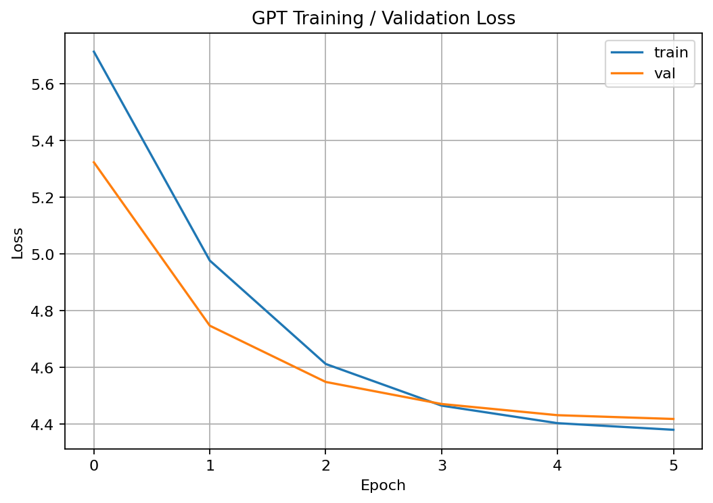
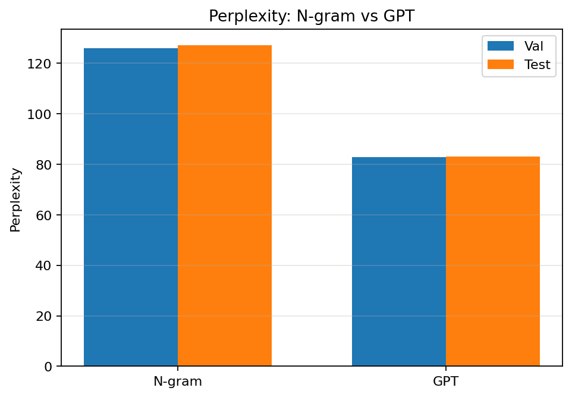

# GPT-from-Scratch (Shakespeare)

This project was built step by step during the *Building GPT from Scratch* seminar.  
It implements three levels of language modeling on Shakespeare’s works:

1. **Byte Pair Encoding (BPE) Tokenizer**  
2. **Statistical N-gram Language Model** (with Laplace smoothing + interpolation)  
3. **Decoder-only Transformer (GPT)** trained from scratch

---

## 🔑 Key Features
- **Tokenizer:** BPE with 500 merges, trained on the train split only.  
- **N-gram Model:** up to 4-gram, add-one (Laplace) smoothing, simple interpolation.  
- **GPT Model:** multi-layer Transformer decoder, GELU activations, masked self-attention.  
- **Training:** cosine learning rate scheduler, AdamW optimizer.  
- **Evaluation:** perplexity on validation & test sets, plots of training/validation loss.  
- **Qualitative analysis:** sample text generations at the end of training.

---

## 📊 Results

**Tokenizer**  
- Vocab size (after merges): **519**

**Perplexity Comparison (lower is better)**

| Model  | Val PPL | Test PPL |
|--------|---------|----------|
| N-gram (n=3) | 126.1 | 127.3 |
| GPT (4-layer, 256-dim) | **82.9** | **83.1** |

**Training & Validation Loss**  


**Perplexity Comparison Plot**  



---
💡 Discussion & Conclusion

Our experiments highlight the progression from classical statistical models to modern neural architectures:

BPE Tokenizer reduced the vocabulary size to 519 subword tokens, making rare words decomposable into smaller units and easing the learning problem.

N-gram baseline achieved validation/test perplexities around 126–127. This shows that while N-grams capture local co-occurrence statistics, they struggle with longer contexts and suffer from data sparsity.

GPT model significantly improved perplexity to ~83 on both validation and test. This demonstrates the advantage of self-attention and learned embeddings in modeling longer dependencies and richer context compared to fixed N-grams.

Loss curves show stable convergence within 6 epochs, with validation loss flattening but not diverging, indicating little overfitting.

Qualitative generations produce fluent Shakespeare-style fragments, though still with repetition and invented words at this small scale. This reflects both the limited model size and training time, and also shows that larger GPTs achieve much better fluency.

Conclusion:
Even with a small decoder-only Transformer trained from scratch on Shakespeare, we achieve a clear improvement over traditional N-gram models. This validates the seminar’s core lesson: subword tokenization + attention-based neural models provide much stronger language modeling ability than classical statistical methods. Further gains would be expected with larger BPE vocabularies, deeper models, longer training, and GPU acceleration.

## 📝 Sample Generation

Seed: `"love"`

love and life to your polones of your confrain my botters caping of word of the life
that the stonius case me of our ressing tins of a does and purderly in your mp to be
the world of the light and the spion my lord and the sufol


(see more in `outputs/sample_generation.txt`)

---

## 🚀 How to Run

### Requirements
```bash
pip install -r requirements.txt
📂 Project Structure
gpt_from_scratch/
├── main.py               # end-to-end training & evaluation
├── models/
│   └── transformer.py    # GPT model implementation
├── utils/
│   ├── bpe.py            # BPE tokenizer
│   ├── ngram.py          # N-gram model
│   └── data.py           # dataset helpers
├── corpora/              # Shakespeare clean train/val/test
└── outputs/              # plots, checkpoints, generations, summary


